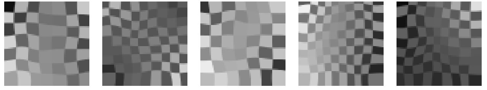
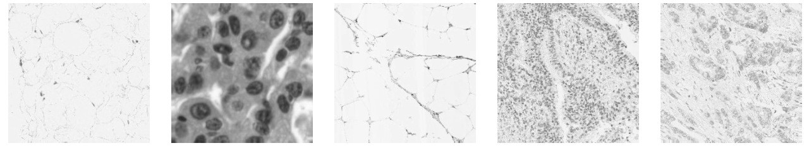
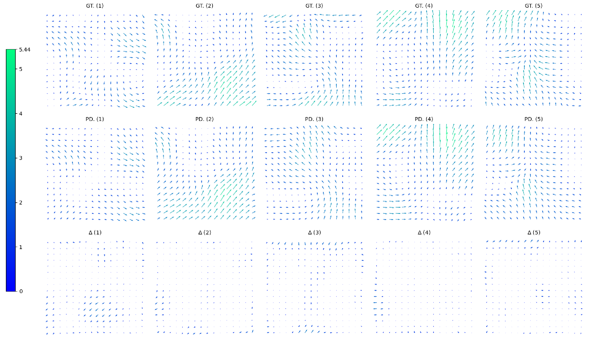
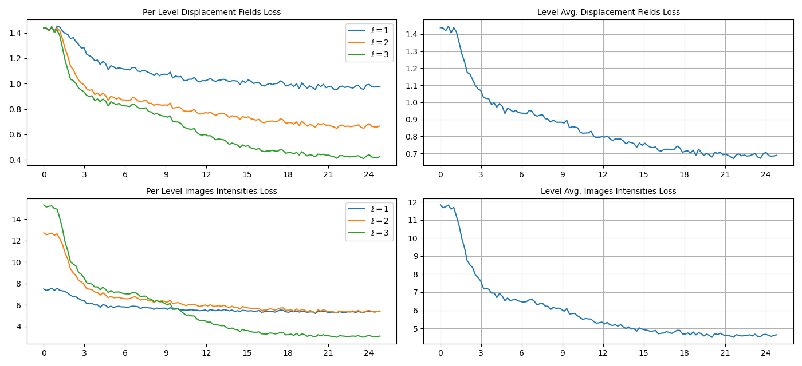
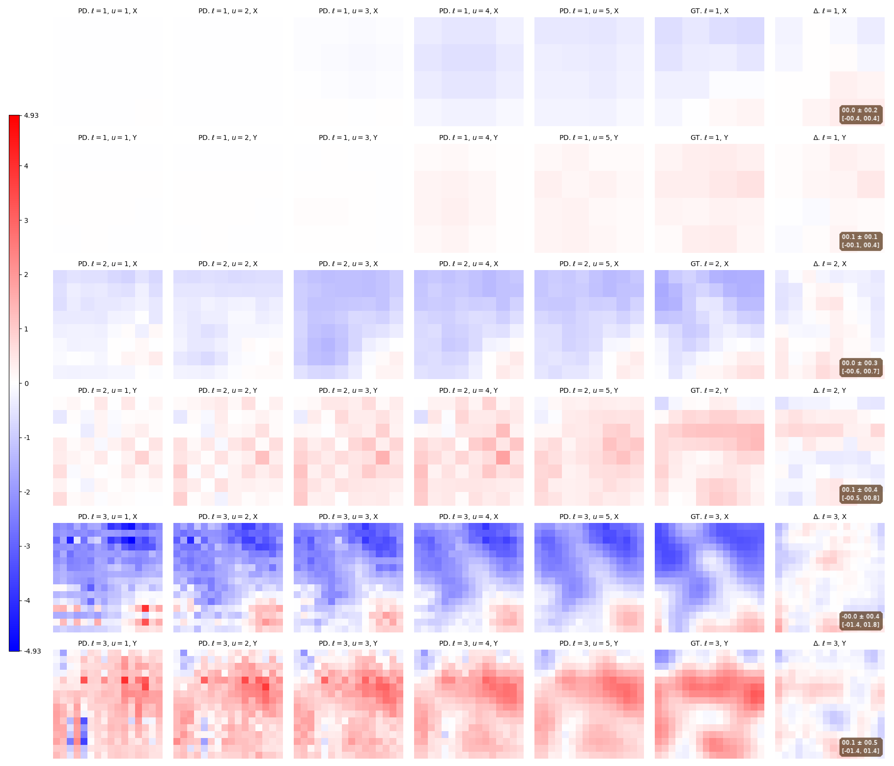
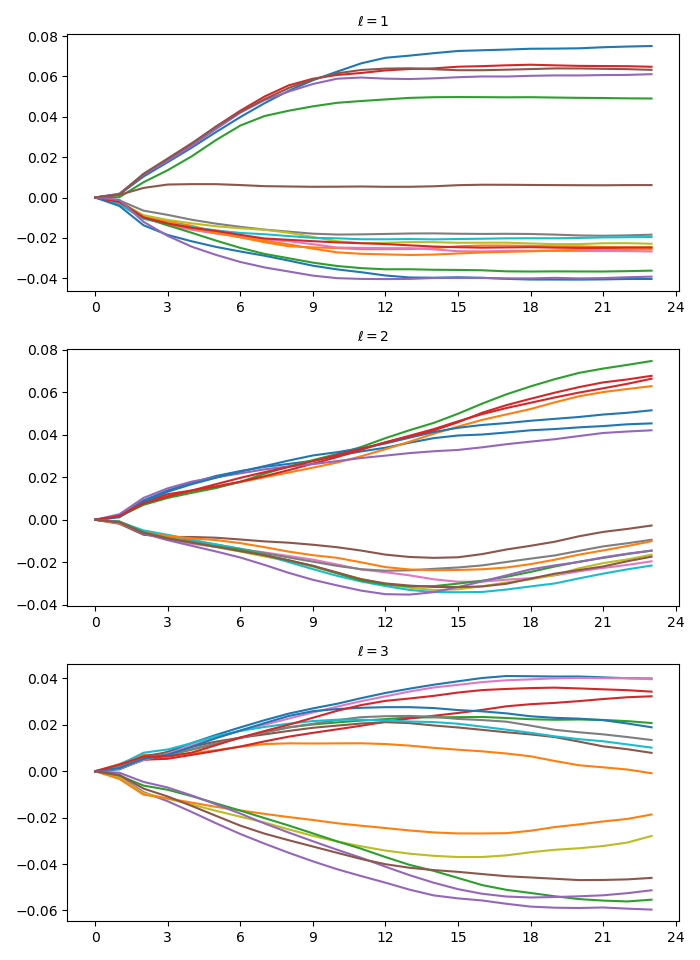

# DIRV-Net

2D/3D Deformable Image registration using deep learning and convolutional variational networks, implemented using Tensorflow.

My master thesis in Machine learning and Image analysis.

## Abstract

Deformable image registration is important for cancer treatments that utilize an MR-Linac (a linear accelerator with integrated magnetic resonance imaging).

Traditional methods of two- and three-dimensional image registration require equipment-specific, handcrafted approaches and lack the necessary image alignment speed for these applications.

We introduce a non-black-box deep learning convolutional variational network for two- and three-dimensional deformable medical image registration, called DIRV-Net, which can learn by utilizing either supervised or unsupervised approaches. The model uses variational networks, fields of experts, and image pyramids for iterative prediction of displacement fields.

Our model demonstrates its ability to register two- and three-dimensional images deformed with complex, smooth deformations to near maximum theoretical accuracy.

It also shows generalizability and robustness against various image structures and features, including previously unseen ones.

## Detailed Report

A stripped version of my report with theoretical foundations of the DIRV-Net, and the experimental results, can be found in [Deep-Learning Based 3D Deformable Registration of MR-Images](../support/report/report_stripped.pdf).

## The Code

Most of the code is in Python and uses Tensorflow mainly.

It is well commented, and self contained.

Some of the non-essential code in support folder for testing and experimenting individual functions may be broken due to some refactoring.

For installation and how to use see below.

## Results Examples

A sample from the datasets used:





An example of the synthetically generated ground truth and predicted displacement vector fields.



An example of the model training progress at each pyramid level.



Model internals: shows predicted displacement fields in each variational unit at every pyramid level.



An example of the learned activation functions.



## Folder Structure Description

```text
[Source] (Self-contained).
│
├── [Model]: The core functionality of the DIRV-Net (self-contained).
│   │
│   ├── [Main]: The variational model and fields of experts.
│   │    │
│   │    └── [Pipeline]: Classes to define pipeline.
│   │         │
│   │         └──  [Field of Experts]: Various fields of experts.
│   │
│   ├── [Settings]: Model configurations.
│   │
│   └── [Tools]: Helper functions for the core functionality.
│       │
│       └──  [Operators]: Various operator implementations.
│
└── [Framework]: Functions for model training/testing and data loading.
    │
    ├── [Main]: Functions for image registration and training.
    │   │
    │   ├── [Data Management]: To manage datasets, batches, etc.
    │   │
    │   ├── [Refinement]: Recurrent refinement implementation.
    │   │
    │   └── [Reporting]: Tensorboard and file logging functions.
    │       │
    │       └── [Generators]: Generators for Tensorboard images.
    │
    ├── [Settings]: Framework and model configurations.
    │   │
    │   └── [Surrogate Loss Functions]: various loss functions.
    │
    └── [Tools]: Helper functions for the framework functionality.
```

```text
[Support]:
│
├── [Tests]: Various tests (some could be broken).
│
├── [Scripts]: Scripts to generate test data from medical images (some could be broken).
│
└── [Docs]: Documentation assets.
```

## Setup

See [Installation](../support/docs/installation.md).

## Usage

See [Usage](../support/docs/usage.md).

## Contributors

- TMS-Namespace
- [Claudio Fanconi](https://github.com/fanconic)

## Code References

- <https://github.com/visva89/VarNetRecon>
- <https://github.com/visva89/pTVreg/blob/master/ptv/ptv_register.m>
- <https://github.com/daviddao/spatial-transformer-tensorflow/blob/master/spatial_transformer.py>
- <https://github.com/linz94/mfin-cycle>
- <https://github.com/sarthakksu/covid-low-income-bam/blob/a9ab0de05b525db3137570989fc4cef64130d659/factorize_a_city/libs/image_alignment.py>
